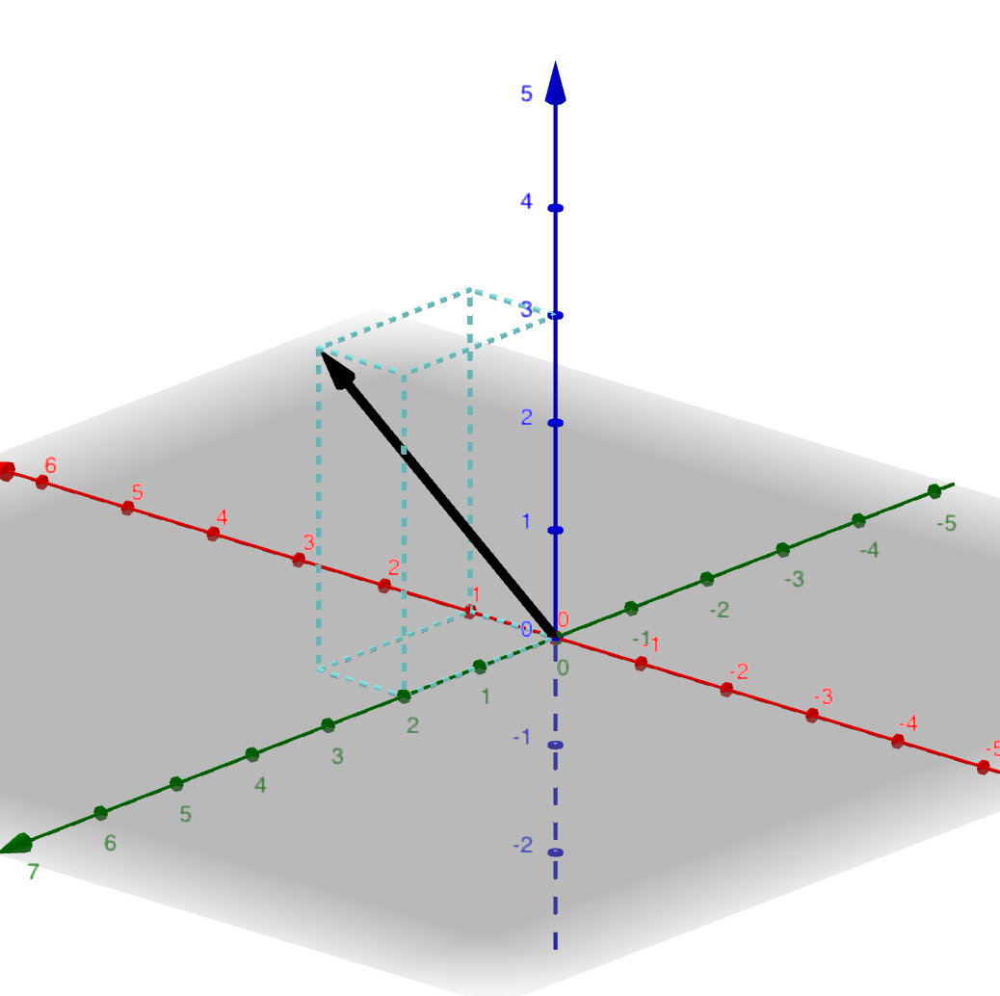
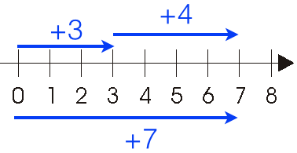

```python
%matplotlib inline
#%matplotlib notebook

import matplotlib
import numpy as np
import matplotlib.pyplot as plt
import matplotlib.ticker as ticker
from mpl_toolkits.mplot3d import Axes3D
import matplotlib.patches as mpatches
from matplotlib.patches import Arc
import math
from mpl_toolkits import mplot3d
from matplotlib.pyplot import *
from matplotlib import collections as mc
```

# Vectors

Hi there! Welcome to the guide on vectors!

Vectors are a very important concept in linear algebra and serve as a fundamental primitive. They are used in various ways all throughout linear algebra, calculus, physics, and many other domains. As a result, introducing vectors serves as a logical starting point in our exploration of linear algebra.

When talking about concepts, we tend to create symbols to represent these concepts. For instance, the words that we use every day are symbolic representation of concepts. Once we have symbols to represent concepts, it's easy to communicate and develop rules around the symbols. In fact, that's what an _algebra_ is. An algebra can be defined as the creation of a set of symbols and rules for manipulating these symbols. As it relates to linear algebra, vectors are such a symbol.

**Vectors are simply a list of numbers that have specific meaning**. For example, in physics, velocity can be represented as a vector. In chemistry, the number of molecules composing a compound can be expressed as a vector. In sociology, the results of a survey can be expressed a vector. Let's see what a vector looks like:

$$\begin{bmatrix}v_1 \\ v_2 \\ \dots \\ v_i\end{bmatrix}$$

Where $v_1, v_2, \dots v_i$ are real numbers. An example of a vector with 2 numbers:

$$\begin{bmatrix}1 \\ 2\end{bmatrix}$$

Vectors (and matrices as we'll see later) are represented as a list of numbers surrounded by square brackets. Each number in the vector is commonly called a **component** or **element**.

A common way to understand a concept like vectors is to visualize it somehow. We can easily visualize vectors by viewing them geometrically and plotting them in a coordinate system. For example, let's take the vector above:

$$\begin{bmatrix}1 \\ 2\end{bmatrix}$$

And try to visualize it. When thinking about a vector geometrically, we allow the components to be a simple point in the coordinate system. Since the vector above has 2 components, we can visualize it in the X-Y plane by allowing the first component, `1`, to be the X-coordinate and the second component, `2`, to be the Y-coordinate:


```python
from matplotlib.ticker import MaxNLocator

axhline(y=0, color='k', linewidth=0.5)
axvline(x=0, color='k', linewidth=0.5)
grid(linestyle='dotted')
axis([-1, 3, -1, 3])
annotate('Vector [1, 2] representing x = 1, y = 2', xy=(0.5, 2.1), ha='left')
quiver([0], [0], 1, 2, angles='xy', scale_units='xy', scale=1)
plot([0, 1, 1, 1], [0, 0, 0, 2], 'b--')
annotate('x = 1', xy=(0.5, -0.25), ha='center', color='blue')
annotate('y = 2', xy=(1.1, 1.0), ha='left', color='blue')
show()
```


Vectors are drawn as arrows with a starting point and an ending point. The black arrow above is the vector $\begin{bmatrix}1 \\ 2\end{bmatrix}$ with a starting point of the origin $(0, 0)$. Since $x = 1, y = 2$, we move 1 unit in the positive X-direction and 2 units in the positive Y-direction to arrive at the endpoint. Vectors are generally drawn as an arrow to differentiate them from a line segment.

Vectors are not limited to just 2 components. This same process scales to vectors with any number of components. For example, here is a vector with 3 components:

$$\begin{bmatrix}1 \\ 2 \\ 3\end{bmatrix}$$

This represents a vector in 3D. Geometrically, we can allow $x = 1, y = 2, z = 3$. In order to visualize this vector, we need a 3D coordinate system:

<span style="display: none">(outputs/Vectors_attach_3_image.png)</span>

<figcaption style="display: block; text-align:center;">(<a href="https://www.geogebra.org/3d/nhytbgup">image source</a>)</figcaption>

In order to visualize this vector, we move 1 unit in X-direction (red axis), 2 units in the Y-direction (green axis), and 3 in the Z-direction (blue axis). Note, the light blue box in the plot above is just a visualization aid.

Beyond 3 components, it becomes difficult (or impossible) to visualize, but the vectors are still completely valid. For example:

$$\begin{bmatrix}1 \\ 0 \\ 2 \\ 1 \\ 4\end{bmatrix}$$

This vector represents a vector in 5D. Good luck trying to visualize that.

## Magnitude and direction

A vector has **magnitude** (how long it is) and **direction** (the direction it is pointing in). In later guides, we'll learn more about magnitude and direction, but it's important to note that the components in a vector are what determine these characteristics. The idea behind magnitude and direction become clear when we view vectors geometrically. For example, consider the two vectors:

$$\begin{bmatrix}1 \\ 2\end{bmatrix}, \begin{bmatrix}2 \\ 1\end{bmatrix}$$

Clearly, the components are different, but let's visualize them:


```python
axis([0, 5, 0, 5])
annotate('Vector [1, 2]', xy=(1.1, 2), ha='left', color='red')
annotate('Vector [3, 1]', xy=(2.1, 1), ha='left', color='blue')
quiver([0], [0], 1, 2, angles='xy', scale_units='xy', scale=1, color='red')
quiver([0], [0], 2, 1, angles='xy', scale_units='xy', scale=1, color='blue')
show()
```


You can see that the vectors are clearly pointing in different directions even though they look the same length. Because these vectors point in a different _direction_, they are completely different vectors. Similarly, vectors can point in the same direction, but have a a different _magnitude_ (i.e., length). Consider the following 2 vectors:

$$\begin{bmatrix}2 \\ 2\end{bmatrix}, \begin{bmatrix}4 \\ 4\end{bmatrix}$$


```python
axis([0, 5, 0, 5])
annotate('Vector [2, 2]', xy=(2, 1.6), ha='left', color='red')
annotate('Vector [4, 4]', xy=(4, 3.6), ha='left', color='blue')
quiver([0], [0], 4, 4, angles='xy', scale_units='xy', scale=1, color='blue')
quiver([0], [0], 2, 2, angles='xy', scale_units='xy', scale=1, color='red')
show()
```


They are pointing in the same direction, but the blue vector is twice as long as the red vector, thus the 2 vectors have different magnitudes. These are 2 different vectors.

An important thing to call out is that magnitude can be different without affecting direction and vice versa as was demonstrated above. Or, they can both be different:


```python
axis([0, 3, 0, 3])
annotate('Vector [1, 1]', xy=(1, 1), xytext=(1, 1), ha='left', color='red')
annotate('Vector [2, 1]', xy=(2, 1), xytext=(2, 1), ha='left', color='blue')
quiver([0], [0], 1, 1, angles='xy', scale_units='xy', scale=1, color='red')
quiver([0], [0], 2, 1, angles='xy', scale_units='xy', scale=1, color='blue')
show()
```


These 2 vectors are pointing in different directions _and_ have different lengths.

## Representing vectors

Now that we have an idea of what a vector is, let's see how we can represent it. In algebra, we can allow a symbol to represent a variable that is real number (oftentimes called a **scalar**):

$$x = 5$$

Above we "assign" $x$ the real number of $5$. Similarly, we can assign vectors to symbols as well. The symbol names can be whatever you want, but conventionally, symbols that represent vectors tend to have an arrow over the top of them to differentiate them from the standard algebraic variable above.

$$\vec{a} = \begin{bmatrix}3 \\ 5\end{bmatrix}$$

In other instances, you may see a vector symbol in bold:

$$\textbf{a} = \begin{bmatrix}3 \\ 5\end{bmatrix}$$

When referencing a vector, I'll usually stick to the arrow-based method.

Okay, now that we understand how a vector is represented with a symbol, let's see how we can represent a vector in Python. Let's code up the vector:

$$\vec{v} = \begin{bmatrix}1 \\ 2\end{bmatrix}$$


```python
v = [1, 2]
```

To keep things simple, we can easily represent a vector as a simple list. In the future, we may choose to represent the vector as a class, but for now, let's keep it simple.

## Operating on vectors

Vectors wouldn't be all that interesting if we couldn't do anything with them. An interesting thing about vectors is that they behave a lot like regular numbers. In fact, that's where the _algebra_ in linear algebra comes from. You can use many of the same algebraic operations you learned in grade school in linear algebra, but instead of simple numbers, you use vectors instead.


### Vector addition

One of the first operations we all learned was that of simple addition. Given 2 numbers, addition produces a new number that is the result of combining the two numbers on the left:

$$3 + 4 = 7$$

Fortunately, the same operations apply to vectors. The result of adding 2 vectors is another vector:

$$\begin{bmatrix}1 \\ 2\end{bmatrix} + \begin{bmatrix}3 \\ 4\end{bmatrix} = \begin{bmatrix}1 + 3 \\ 2 + 4\end{bmatrix} = \begin{bmatrix}4 \\ 6\end{bmatrix}$$

The addition of vectors is done _component wise_, that is the first component of $\begin{bmatrix}1 \\ 2\end{bmatrix}$  (which is $1$) is added to the first component of $\begin{bmatrix}3 \\ 4\end{bmatrix}$ (which is 3) to produce the first component of the result (which is $1 + 3 = 4$). This process is repeated for all the components. Since both operands are vectors, the result is also a vector:

$$\begin{bmatrix}4 \\ 6\end{bmatrix}$$

As simple addition can be viewed graphically on a number line, the same can be done for vectors. As an example, let's add the following 2 vectors:

$$\begin{bmatrix}1 \\ 2\end{bmatrix} + \begin{bmatrix}2 \\ 1\end{bmatrix} = \begin{bmatrix}3 \\ 3\end{bmatrix}$$

Following the steps from above, we arrived at a resulting vector of $\begin{bmatrix}3 \\ 3\end{bmatrix}$. It's helpful to visualize this addition by visualizing the vectors geometrically. Below, the red arrow represents the vector $\begin{bmatrix}1 \\ 2\end{bmatrix}$ and the blue arrow represents the vector $\begin{bmatrix}2 \\ 1\end{bmatrix}$. The magenta arrow represents the vector $\begin{bmatrix}3 \\ 3\end{bmatrix}$ which is the result of adding the the 2 vectors.


```python
axis([0, 5, 0, 5])
quiver([0], [0], 1, 2, angles='xy', scale_units='xy', scale=1, color='red')
quiver([1], [2], 2, 1, angles='xy', scale_units='xy', scale=1, color='blue')
quiver([0], [0], 3, 3, angles='xy', scale_units='xy', scale=1, color='magenta')

v1 = mpatches.Patch(color='red', label='Vector [1, 2]')
v2 = mpatches.Patch(color='blue', label='Vector [3, 4]')
v3 = mpatches.Patch(color='magenta', label='Vector [4, 6]')
legend(handles=[v1, v2, v3])

annotate('[1, 2] + [3, 4] = [4, 6]', xy=(1.8, 1.5), xytext=(1.8, 1.5), ha='left', color='magenta')

show()
```


Adding 2 scalar numbers can be visualized using an number line. To add the numbers $3$ and $4$:


(source: http://mathandmultimedia.com/2015/07/25/add-integers-using-the-number-line/)

We simply move $3$ units in the positive direction and then from that spot move $4$ more units in the positive direction. You can also imagine this as if we had 2 ropes of length $3$ and $4$ and we lined them up end to end, then the combined length of the 2 ropes would be $7$.

This analogy of addition is useful for understanding vector addition, because the addition of 2 vectors is conceptually the result of lining up the 2 vectors end-to-end to arrive at the result. In the above example, the vector $\begin{bmatrix}1 \\ 2\end{bmatrix}$ is plotted starting from the origin like we did above. Next, the vector $\begin{bmatrix}2 \\ 1\end{bmatrix}$ is plotted starting at where $\begin{bmatrix}1 \\ 2\end{bmatrix}$ ends. In total, after lining up the 2 vectors end-to-end, you can see that we moved 3 units to the right and 3 units up which is precisely the resulting vector $\begin{bmatrix}3 \\ 3\end{bmatrix}$.

You can imagine the resulting vector (the magenta vector above) like a route—traveling 1 unit east and 2 units north followed by traveling 2 units east and 1 unit north, you arrive at the location $\begin{bmatrix}3 \\ 3\end{bmatrix}$. You would arrive at the same spot by simply starting from the origin and traveling to $\begin{bmatrix}3 \\ 3\end{bmatrix}$.

### Commutability

Like simple addition, vector addition is commutative. For example:

$$\begin{bmatrix}1 \\ 2\end{bmatrix} + \begin{bmatrix}2 \\ 1\end{bmatrix} = \begin{bmatrix}2 \\ 1\end{bmatrix} + \begin{bmatrix}1 \\ 2\end{bmatrix} = \begin{bmatrix}3 \\ 3\end{bmatrix}$$

We still arrive at the same result no matter which comes first. If we plot $\begin{bmatrix}2 \\ 1\end{bmatrix}$ first and then add $\begin{bmatrix}1 \\ 2\end{bmatrix}$, as expected, the addition still takes us to the same resulting vector:


```python
axis([0, 5, 0, 5])
quiver([0], [0], 2, 1, angles='xy', scale_units='xy', scale=1, color='blue')
quiver([2], [1], 1, 2, angles='xy', scale_units='xy', scale=1, color='red')
quiver([0], [0], 3, 3, angles='xy', scale_units='xy', scale=1, color='magenta')

v1 = mpatches.Patch(color='blue', label='Vector [2, 1]')
v2 = mpatches.Patch(color='red', label='Vector [1, 2]')
v3 = mpatches.Patch(color='magenta', label='Vector [3, 3]')
legend(handles=[v1, v2, v3])

annotate('[2, 1] + [1, 2] = [3, 3]', xy=(0.2, 2), xytext=(0.2, 2), ha='left', color='magenta')

show()
```


So far, our examples of addition have been limited to vectors that only have 2 components, but all the operations in this guide apply to vectors of arbitrary size (i.e., any number of components). For example, here is addition with vectors that have 5 components:

$$
\begin{bmatrix}1 \\ 2 \\ 0 \\ 3 \\ 4\end{bmatrix} + \begin{bmatrix}3 \\ 1 \\ 2 \\ 0 \\ 1\end{bmatrix} =
\begin{bmatrix}4 \\ 3 \\ 2 \\ 3 \\ 5\end{bmatrix}
$$

However, it quickly becomes impossible to visualize larger vectors, because we plot a vector with 2 components on a X-Y plane and a vector with 3 components on a X-Y-Z plane. It's hard for the human mind to conceptualize dimensions beyond 3.

### Vector subtraction
Unsurprisingly, subtraction is done component wise just like addition:

$$\begin{bmatrix}3 \\ 5\end{bmatrix} - \begin{bmatrix}2 \\ 2\end{bmatrix} = \begin{bmatrix}3 - 2 \\ 5 - 2\end{bmatrix} = \begin{bmatrix}1 \\ 3\end{bmatrix}$$

Another way to view subtraction is as negative addition. An intuitive reason for why this is useful can be seen when vector subtraction is visualized. For example, this is equivalent to the above:

$$\begin{bmatrix}3 \\ 5\end{bmatrix} + \begin{bmatrix}-2 \\ -2\end{bmatrix} = \begin{bmatrix}3 + (-2) \\ 5 + (-2)\end{bmatrix} = \begin{bmatrix}1 \\ 3\end{bmatrix}$$

Verbalized, this is equivalent to traveling 3 units to the right, 5 units up (to get to $\begin{bmatrix}3 \\ 5\end{bmatrix}$) followed by 2 units to the left and 2 units down (equivalent to $\begin{bmatrix}-2 \\ -2\end{bmatrix}$). Below, the red vector is $\begin{bmatrix}3 \\ 5\end{bmatrix}$ and the blue vector is $\begin{bmatrix}2 \\ 2\end{bmatrix}$ (or $\begin{bmatrix}-2 \\ -2\end{bmatrix}$ viewed as negative addition):


```python
plot([3], [5], markersize=5, color='red')
plot([2], [2], markersize=5, color='blue')
axis([0, 5, 0, 6])
quiver([0, 3, 0], [0, 5, 0], [3, -2, 1], [5, -2, 3], angles='xy', scale_units='xy', scale=1, color=['red', 'blue', 'magenta'])
annotate('Vector [3, 5]', xy=(1.7, 2.5), xytext=(1.7, 2.5), ha='left', color='red')
annotate('Vector [-2, -2]', xy=(1.2, 4.5), xytext=(1.2, 4.5), ha='left', color='blue')
annotate('[1, 3]', xy=(0.2, 2), xytext=(0.2, 2), ha='left', color='magenta')

v1 = mpatches.Patch(color='red', label='Vector [3, 5]')
v2 = mpatches.Patch(color='blue', label='Vector [-2, -2]')
v3 = mpatches.Patch(color='magenta', label='Vector [1, 3]')
legend(handles=[v1, v2, v3])
show()
```


### Scalar multiplication of vector
You can multiply a number and a vector. Scalar multiplication is performed by multiplying each component in the vector by the scalar:

$$3 * \begin{bmatrix}1 \\ 2\end{bmatrix} = \begin{bmatrix}3 * 1 \\ 3 * 2\end{bmatrix} = \begin{bmatrix}3 \\ 6\end{bmatrix}$$

Conceptually, this is the same thing as repeated addition:

$$3 * \begin{bmatrix}1 \\ 2\end{bmatrix} = \begin{bmatrix}1 \\ 2\end{bmatrix} + \begin{bmatrix}1 \\ 2\end{bmatrix} + \begin{bmatrix}1 \\ 2\end{bmatrix} = \begin{bmatrix}3 \\ 6\end{bmatrix}$$

Geometrically, this can be thought of as stretching or shrinking the vector (depending on what the scalar number is). The plot on the left is the result of multiplying each component by 3 and the plot on the right is the concept of repeated addition. Using what we know about addition from above, you can visualize scalar multiplication as lining up 3 copies of the vector $\begin{bmatrix}1 \\ 2\end{bmatrix}$ end-to-end. The key takeaway is that of the fact that the resulting vector is simply a scaled version of the original vector.


```python
fig, axes = plt.subplots(ncols=2, sharex=True, sharey=False, figsize=(15, 15))
axes[0].set(adjustable='box', aspect='equal')
axes[1].set(adjustable='box', aspect='equal')

axes[0].axis([0, 7, 0, 7])
axes[0].quiver([0, 0], [0, 0], [3, 1], [6, 2], angles='xy', scale_units='xy', scale=1, color=['blue', 'red'])
#axes[0].plot([3], [6], marker='o', markersize=5, color='black')
axes[0].annotate('Vector [3, 6]', xy=(3, 6), xytext=(3.1, 6.1), ha='left', color='blue')

axes[1].axis([0, 7, 0, 7])
axes[1].quiver([0, 1, 2], [0, 2, 4], [1, 1, 1], [2, 2, 2], angles='xy', scale_units='xy', scale=1, color=['red', 'red', 'red'])
#axes[1].plot([3], [6], marker='o', markersize=5, color='black')
axes[1].annotate('Vector [3, 6]', xy=(3, 6), xytext=(3.1, 6.1), ha='left', color='red')

#f1, a1 = plt.subplot(121, aspect='equal')
#plt.quiver([0, 0], [0, 0], [3, 1], [6, 2], angles='xy', scale_units='xy', scale=1, color=['blue', 'red'])

#f2, a2 = plt.subplot(122, aspect='equal')
#plt.quiver([0, 0], [0, 0], [3, 1], [6, 2], angles='xy', scale_units='xy', scale=1, color=['blue', 'red'])
#v1 = mpatches.Patch(color='red', label='Vector [1, 2]')
#v2 = mpatches.Patch(color='blue', label='Vector [3, 6]')
#plt.legend(handles=[v1, v2])
plt.show()
```


### Scalar division of vector
You usually won't find references to scalar division in resources, but for sake of completeness, I'm including it here. Dividing a vector by a scalar $s$ can simply be viewed as scalar multiplication with the scalar being $\frac{1}{s}$:

$$\begin{bmatrix}2 \\ 4\end{bmatrix} \div 2 = \frac{1}{2}*\begin{bmatrix}2 \\ 4\end{bmatrix} = \begin{bmatrix}1 \\ 2\end{bmatrix}$$

### Multiplication of vectors
It would be reasonable to conclude that we can multiply 2 vectors together simply by multiplying their components. However, this is **not** the case. Vector multiplication is a more involved process that we'll talk about later. For now, we'll focus on addition, subtraction, and scalar multiplication.

## Vectors with different number of components?

You may have noticed that the operations performed on vectors are done with vectors that have the same number of components. It's impossible to perform component-wise operations on vectors with a different number of components. For instance:

$$\begin{bmatrix}2 \\ 1\end{bmatrix} - \begin{bmatrix}1 \\ 3 \\ 5\end{bmatrix} = ?$$

This operation is not allowed because $\begin{bmatrix}2 \\ 1\end{bmatrix}$ and $\begin{bmatrix}1 \\ 3 \\ 5\end{bmatrix}$ have a different number of components.

## More than 2 vectors?

It may go without saying, but for the sake of explicitness, vector operations can be be applied to any number of vectors, not just 2. For instance, here is an example of addition of 4 vectors:

$$
\begin{bmatrix}2 \\ 1\end{bmatrix} + \begin{bmatrix}1 \\ 2\end{bmatrix} + \begin{bmatrix}1 \\ 0\end{bmatrix} + \begin{bmatrix}3 \\ 2\end{bmatrix} = \begin{bmatrix}7 \\ 5\end{bmatrix}
$$

Additionally, just like with scalar numbers, we can "chain" different operations together. When doing so, the same order of operations applies to vectors:

$$
2 * \begin{bmatrix}2 \\ 1\end{bmatrix} + 3 * \begin{bmatrix}1 \\ 2\end{bmatrix} = \begin{bmatrix}7 \\ 8\end{bmatrix}
$$

We perform the multiplication first then the addition.

## Linear combinations

Above we showed that we can multiply a vector $\vec{v}$ by a scalar component $c$:

$$
\vec{v} = \begin{bmatrix}v_1 \\ v_2 \\ \dots \\ v_i\end{bmatrix}, \enspace\enspace c\vec{v} = c\begin{bmatrix}v_1 \\ v_2 \\ \dots \\ v_i\end{bmatrix} = \begin{bmatrix}cv_1 \\ cv_2 \\ \dots \\ cv_i\end{bmatrix}
$$

And that we can add (or subtract) two vectors $\vec{u}$ and $\vec{v}$:

$$
\vec{u} = \begin{bmatrix}u_1 \\ u_2 \\ \dots \\ u_i\end{bmatrix}, \vec{v} = \begin{bmatrix}v_1 \\ v_2 \\ \dots \\ v_i\end{bmatrix}, \enspace\enspace
\vec{u} + \vec{v} = \begin{bmatrix}u_1 + v_1 \\ u_2 + v_2 \\ \dots \\ u_i + v_i\end{bmatrix}
$$

We can combine these 2 operations into one step called a **linear combination**:

$$
\vec{u} = \begin{bmatrix}u_1 \\ u_2 \\ \dots \\ u_i\end{bmatrix}, \vec{v} = \begin{bmatrix}v_1 \\ v_2 \\ \dots \\ v_i\end{bmatrix}, \enspace\enspace
c\vec{u} + d\vec{v} = \begin{bmatrix}cu_1 + dv_1 \\ cu_2 + dv_2 \\ \dots \\ cu_i + dv_i\end{bmatrix}
$$

Let's take an example by finding the linear combination of the two vectors $\vec{u}$ and $\vec{v}$ and scalars $c$ and $d$:

$$
\vec{u} = \begin{bmatrix}1 \\ 2\end{bmatrix}, \vec{v} = \begin{bmatrix}3 \\ 2\end{bmatrix}, \enspace\enspace
c\vec{u} + d\vec{v} = \begin{bmatrix}c + 3d \\ 2c + 2d\end{bmatrix}
$$

Another example: let's say that we have the following result from the linear combination of $\vec{u}$ and $\vec{v}$ from above:

$$\begin{bmatrix}5 \\ 6\end{bmatrix}$$

This vector is the result of the following linear combination of $\vec{u}$ and $\vec{v}$ where the scalars are $c = 2$, $d = 1$:

$$
\vec{u} = \begin{bmatrix}1 \\ 2\end{bmatrix}, \vec{v} = \begin{bmatrix}3 \\ 2\end{bmatrix}, \enspace\enspace
2\vec{u} + 1\vec{v} = \begin{bmatrix}(2*1) + (1*3) \\ (2*2) + (1*2)\end{bmatrix} = \begin{bmatrix}5 \\ 6\end{bmatrix}
$$

Naturally, the concept of a linear combination scales to any number of vectors and scalars:

$$
(c_1 * \begin{bmatrix}u_1 \\ u_2 \\ \dots \\ u_i\end{bmatrix}) + (c_2 * \begin{bmatrix}v_1 \\ v_2 \\ \dots \\ u_i\end{bmatrix}) + \dots + (c_j * \begin{bmatrix}w_1 \\ w_2 \\ \dots \\ u_i\end{bmatrix})
$$

Where $c_1, c_2, \dots, c_j$ are scalar numbers. Linear combinations are super useful and used throughout linear algebra and this guide, so you should be comfortable with them. 

## Negativity

One minor thing worth mentioning is that we've been referencing and visualizing vectors that are positive and live in the first quandrant. That is more out of convenience. Vectors with negative components exist and are first-class citizens along with their non-negative brethern. For example, consider the following operation:

$$\begin{bmatrix}2 \\ 1\end{bmatrix} - \begin{bmatrix}1 \\ 3\end{bmatrix} = \begin{bmatrix}1 \\ -2\end{bmatrix}$$

The result contains a negative component. This can be visualized as:


```python
#plt.plot([1], [2], markersize=5, color='red')
#plt.plot([2], [2], markersize=5, color='blue')
plt.axis([-1, 3, -3, 3])
plt.quiver([0, 2, 0], [0, 1, 0], [2, -1, 1], [1, -3, -2], angles='xy', scale_units='xy', scale=1, color=['red', 'blue', 'magenta'])
v1 = mpatches.Patch(color='red', label='Vector [2, 1]')
v2 = mpatches.Patch(color='blue', label='Vector [-1, -3]')
v3 = mpatches.Patch(color='magenta', label='Vector [1, -2]')
plt.legend(handles=[v1, v2, v3])
#plt.grid(True, which='both')
plt.axhline(y=0, color='k', linewidth=0.5)
plt.axvline(x=0, color='k', linewidth=0.5)
#plt.xaxis.set_major_locator(ticker.MaxNLocator(integer=True))
plt.show()
```


## Lengths of vectors
Above, I mentioned that vectors have a length (called _magnitude_), but we don't know how to find it yet. It's often useful to find "how long" a vector is and we do this by using the components of the vector. Fortunately, finding the length of a vector is as easy as using the Pythagorean theorem. For example, for a vector with 2 components, we can form a right triangle with the $x$ and $y$ components and calculate the length as the hypotenuse. For instance, we can find the length of the following vector:

$$\vec{v} = \begin{bmatrix}1 \\ 3\end{bmatrix}$$


```python
axhline(y=0, color='k', linewidth=0.5)
axvline(x=0, color='k', linewidth=0.5)
grid(linestyle='dotted')
axis([-1, 4, -1, 4])
annotate('Vector [1, 3] representing x = 1, y = 3', xy=(0.5, 3.1), ha='left')
quiver([0], [0], 1, 3, angles='xy', scale_units='xy', scale=1)
plot([0, 1, 1, 1], [0, 0, 0, 3], 'b--')
annotate('x = 1', xy=(0.5, -0.25), ha='center', color='blue')
annotate('y = 2', xy=(1.1, 1.0), ha='left', color='blue')
annotate('a', xy=(0.5, 0.2), ha='center', color='red')
annotate('b', xy=(0.9, 1.5), ha='right', color='red')
annotate('c', xy=(0.3, 1.5), ha='right', color='red')
show()
```


And, we can use the Pythagorean theorem to find the length of the $\vec{v}$. We can allow the $x$ leg to be $a$, and the $y$ leg to be $b$:

$$
a^2 + b^2 = c^2 \\[3pt]
1^2 + 2^2 = c^2 \\[3pt]
5 = c^2 \\[3pt]
c = \sqrt{5}
$$

Fortunately, the process of finding the magnitude applies to vectors of any size and located anywhere in the plane because we can always form a right angle. Formally, given a vector $\vec{v}$ of arbitrary size, we can find its magnitude:

$$
\vec{v} = \begin{bmatrix}v_1 \\ v_2 \\ \dots \\ v_i\end{bmatrix} \enspace\enspace
length(\vec{v}) = \sqrt{(v_1)^2 + (v_2)^2 + \dots + (v_i)^2}
$$

When referring to the magnitude of a vector, it's common to represent it as the vector surrounded by double bars, $\left\Vert\vec{v}\right\Vert$:

$$\vec{v} = \begin{bmatrix}3 \\ 4\end{bmatrix}, \left\Vert\vec{v}\right\Vert = 5$$

## Component and standard form
When we draw vectors geometrically using the components to represent axes in the coordinate system, this is known as drawing a vector in **component form**. Often times, for convenience sake, vectors will be drawn starting from the origin. In this case, vectors are said to be in **standard form**. Drawing a vector in _standard form_ means the vector is drawn as a directed line segment from the origin to the point that corresponds to the vector's components.

## Positions of vectors

All of the vectors drawn above are drawn in _standard form_ (starting from the origin). This is a matter of convenience. There are no rules that require vectors to be drawn in standard form. The 2 important characteristics of vectors are that they have a certain magnitude and a certain direction. In fact, the following two vectors representing $\begin{bmatrix}1 \\ 2\end{bmatrix}$ are identical:


```python
#plt.plot([1], [2], marker='o', markersize=10, color='red')
plt.axis([0, 5, 0, 5])
plt.quiver([0], [0], 1, 2, angles='xy', scale_units='xy', scale=1, color='red')
plt.quiver([2], [2], 1, 2, angles='xy', scale_units='xy', scale=1, color='blue')
plt.annotate('Vector: [1, 2]', xy=(0.8, 1), xytext=(0.8, 1), ha='left', color='red')
plt.annotate('Vector: [1, 2]', xy=(0.8, 1), xytext=(2.8, 3), ha='left', color='blue')
plt.show()
```


These 2 vectors have the same exact direction and the same magnitude. One just happens to be in standard form and the other "starts" from $x = 2, y = 2$, but they are fundamentally represented as the vector:

$$\begin{bmatrix}1 \\ 2\end{bmatrix}$$

## Vector dimensions

Often, when discussing vectors, you'll hear mention of the word _dimension_. **Dimension** refers to how many components are in the vector. For example, the following vector:

$$\begin{bmatrix}3 \\ 1\end{bmatrix}$$

Is 2-dimensional. You'll often see it written as saying $\begin{bmatrix}3 \\ 1\end{bmatrix}$ is a member of $\mathbb{R}^2$. Here are a few other examples:

$$
\begin{bmatrix}3 \\ 1 \\ 2\end{bmatrix} \enspace\rightarrow\enspace \mathbb{R}^3 \qquad
\begin{bmatrix}1\end{bmatrix} \enspace\rightarrow\enspace \mathbb{R}^1 \qquad
\begin{bmatrix}3 \\ 1 \\ 2 \\ -2\end{bmatrix} \enspace\rightarrow\enspace \mathbb{R}^4 \qquad
\begin{bmatrix}5 \\ 0\end{bmatrix} \enspace\rightarrow\enspace \mathbb{R}^2
$$

It's important to call out that even though it looks like the last vector is 1-dimensional because it only runs along the X-axis (because $Y = 0$), since it has 2 components, it is still a member of $\mathbb{R}^2$.

## Putting it all together

Okay, that's a lot. Let's take the concepts we've learned so far and see how we can implement them in Python. To get started, let's define a couple of vectors that we'll use:

$$\vec{a}=\begin{bmatrix}1 \\ 2\end{bmatrix}, \vec{b}=\begin{bmatrix}3 \\ 4\end{bmatrix}$$


```python
# Some boilerplate code
from functools import reduce

# Convert a vector into a string
def v_to_str(v):
    return '[%s]' % (', '.join(map(str, v)))
```


```python
# Define vectors a and b
a = [1, 2]
b = [3, 4]
```

Let's create a method to report the size of a vector, which as you recall is just the number of components in the vector:


```python
# Returns the number of components in a vector
def size(v):
    return len(v)

a_size = size(a)  # Should be 2

# Note, v_to_str is a helper method to convert a Python list into a string
print('Size of %s = %d' % (v_to_str(a), a_size))
```

    Size of [1, 2] = 2


Next, let's work on addition and subtraction of vectors:


```python
# Adding 2 vectors component by component
def add(v1, v2):
    return [v[0] + v[1] for v in zip(v1, v2)]

# Subtracting 2 vectors component by component
def subtract(v1, v2):
    return [v[0] - v[1] for v in zip(v1, v2)]

a_plus_b = add(a, b)        # > [4, 6]
a_minus_b = subtract(a, b)  # > [-2, -2]

print('%s + %s = %s' % (v_to_str(a), v_to_str(b), v_to_str(a_plus_b)))
print('%s - %s = %s' % (v_to_str(a), v_to_str(b), v_to_str(a_minus_b)))
```

    [1, 2] + [3, 4] = [4, 6]
    [1, 2] - [3, 4] = [-2, -2]


Finally, scalar multiplication. Recall above that multiplication can be seen as multiplying each component by a scalar number or repeated addition, so I've included both:


```python
# Multiply a vector and a scalar number
def multiply(vector, num):
    return [num * comp for comp in vector]

# Multiply a vector and a scalar number using repeated addition (using functools.reduce)
def multiply_alt(vector, num):
    return reduce(add, [vector] * num)

scalar = 3
a_times_3 = multiply(a, scalar)  # > [3, 6]
a_times_3_repeated_addition = multiply_alt(a, scalar)  # > [3, 6]

print('%s * %s = %s' % (scalar, v_to_str(a), v_to_str(a_times_3)))
print('%s * %s = %s' % (scalar, v_to_str(a), v_to_str(a_times_3_repeated_addition)))
```

    3 * [1, 2] = [3, 6]
    3 * [1, 2] = [3, 6]


To demonstrate that these operations are not limited to vectors of size 2, here are a few examples using vectors with more components:


```python
# Operations with vectors of size 4
a4 = [1, 2, 3, 4]
b4 = [2, 0, 1, 3]

a4_plus_b4 = add(a4, b4)       # > [3, 2, 4, 7]
a4_minus_b4 = subtract(a4, b4) # > [-1, -2, -2, 1]
a4_times_3 = multiply(a4, 3)   # > [3, 6, 9, 12]

print('%s + %s = %s' % (v_to_str(a4), v_to_str(b4), v_to_str(a4_plus_b4)))
print('%s - %s = %s' % (v_to_str(a4), v_to_str(b4), v_to_str(a4_minus_b4)))
print('%s * %s = %s' % ('3', v_to_str(a4), v_to_str(a4_times_3)))
```

    [1, 2, 3, 4] + [2, 0, 1, 3] = [3, 2, 4, 7]
    [1, 2, 3, 4] - [2, 0, 1, 3] = [-1, 2, 2, 1]
    3 * [1, 2, 3, 4] = [3, 6, 9, 12]


Let's see how we can find the length/magnitude of a vector:


```python
from math import sqrt

# Find the length of a vector using Euclidian distance
def magnitude(vector):
    squares = [ comp**2 for comp in vector ]
    return sqrt(sum(squares))

a_length = magnitude(a)   # > sqrt(5)
a4_length = magnitude(a4) # > sqrt(30)

other = [3, 4]
other_length = length(other)  # > 5

print('Magnitude of %s = %f' % (v_to_str(a), a_length))
print('Magnitude of %s = %f' % (v_to_str(a4), a4_length))
print('Magnitude of %s = %d' % (v_to_str(other), other_length))
```


    ---------------------------------------------------------------------------

    NameError                                 Traceback (most recent call last)

    <ipython-input-21-4e97f13cb58f> in <module>
         10 
         11 other = [3, 4]
    ---> 12 other_length = length(other)  # > 5
         13 
         14 print('Magnitude of %s = %f' % (v_to_str(a), a_length))


    NameError: name 'length' is not defined


Putting together all the pieces:


```python
a = [1, 2]
b = [3, 4]

# Returns the number of components in a vector
def size(v):
    return len(v)

# Adding 2 vectors component by component
def add(v1, v2):
    return [v[0] + v[1] for v in zip(v1, v2)]

# Subtracting 2 vectors component by component
def subtract(v1, v2):
    return [v[0] - v[1] for v in zip(v1, v2)]

# Multiply a vector and a number
def multiply(v1, num):
    return [num * v for v in v1]

# Multiply a vector and a number using repeated addition (using functools.reduce)
def multiply_alt(v1, num):
    return reduce(add, [v1] * num)

# Find the length of a vector using Euclidian distance
def magnitude(vector):
    squares = [ comp**2 for comp in vector ]
    return sqrt(sum(squares))


# Gets the number of components in a
a_size = size(a)

# Adds a and b
a_plus_b = add(a, b)

# Subtracts a and b
a_minus_b = subtract(a, b)

# Multiplies a by the scalar 3
a_times_3 = multiply(a, 3)

# Multiplies a by the scalar 3 using repeated addition
a_times_3_repeated_addition = multiply_alt(a, 3)

# The magnitude of the vector
a_length = magnitude(a)

print('Size of %s = %d' % (v_to_str(a), a_size))
print('%s + %s = %s' % (v_to_str(a), v_to_str(b), v_to_str(a_plus_b)))
print('%s - %s = %s' % (v_to_str(a), v_to_str(b), v_to_str(a_minus_b)))
print('%s * %s = %s' % ('3', v_to_str(a), v_to_str(a_times_3)))
print('%s * %s = %s' % ('3', v_to_str(a), v_to_str(a_times_3_repeated_addition)))
print('Magnitude of %s = %f' % (v_to_str(a), a_length))

# Operations with vectors of size 4
a4 = [1, 2, 3, 4]
b4 = [9, 8, 7, 6]

a4_plus_b4 = add(a4, b4)
a4_minus_b4 = subtract(a4, b4)
a4_times_3 = multiply(a4, 3)

print('%s + %s = %s' % (v_to_str(a4), v_to_str(b4), v_to_str(a4_plus_b4)))
print('%s - %s = %s' % (v_to_str(a4), v_to_str(b4), v_to_str(a4_minus_b4)))
print('%s * %s = %s' % ('3', v_to_str(a4), v_to_str(a4_times_3)))
```

## Summary

In this guide, we introduced the vector, which is one of the basic primitives of linear algebra. We explored what a vector is, what a vector represents, how to perform operations on vectors, and how to represent vectors.

### Vectors

Vectors are defined as a list of numbers, called components:

$$\vec{v} = \begin{bmatrix}v_1 \\ v_2 \\ \ldots \\ v_n\end{bmatrix}$$

Vectors are represented as a symbol with an arrow over it: $\vec{v}$.

### Magnitude and direction
Vectors have a magnitude and direction which uniquely define a vector. The magnitude corresponds to _how long_ a vector is, and the direction corresponds to _which direction_ the vector is pointing in. The magnitude is referenced as $\left\Vert\vec{v}\right\Vert$ and is calculated using the Euclidean distance:

$$\left\Vert\vec{v}\right\Vert = \sqrt{(v_1)^2 + (v_2)^2 + \dots + (v_i)^2}$$

### Operations
Operations are performed component wise. The result of these vector operation is another vector. For example, vector addition:

$$
\vec{v} = \begin{bmatrix}v_1 \\ v_2 \\ \ldots \\ v_n\end{bmatrix}, \vec{w} = \begin{bmatrix}w_1 \\ w_2 \\ \ldots \\ w_n\end{bmatrix}, \enspace\enspace
\vec{v} + \vec{w} = \begin{bmatrix}v_1 + w_1 \\ v_2 + w2 \\ \ldots \\ v_n + w_n\end{bmatrix}
$$

$\vec{v}$ and $\vec{w}$ must have the same number of components. Same for subtraction:

$$\vec{v} - \vec{w} = \begin{bmatrix}v_1 - w_1 \\ v_2 - w2 \\ \ldots \\ v_n - w_n\end{bmatrix}$$

Scalar multiplication by a number $c$ is done by multiplying each component by $c$:

$$
\vec{v} = \begin{bmatrix}v_1 \\ v_2 \\ \ldots \\ v_n\end{bmatrix}, \enspace\enspace c\vec{v} = \begin{bmatrix}cv_1 \\ cv_2 \\ \ldots \\ cv_n\end{bmatrix}
$$

In subsequent documents, we'll dig deeper into more core concepts and build on our knowledge of vectors.

### Geometry
A vector can be viewed geometrically as a directed line segment in space with a starting point and an ending point.

### Linear combination
A combination of scalar multiplication and addition is a linear combination. Consider a linear combination of scalar numbers $c$ and $d$ and vectors $\vec{v}$ and $\vec{w}$:

$$
\vec{v} = \begin{bmatrix}v_1 \\ v_2 \\ \ldots \\ v_n\end{bmatrix}, \vec{w} = \begin{bmatrix}w_1 \\ w_2 \\ \ldots \\ w_n\end{bmatrix}, \enspace\enspace
c\vec{v} + d\vec{w} = \begin{bmatrix}cv_1 + dw_1 \\ cv_2 + dw_2 \\ \ldots \\ cv_n + dw_n\end{bmatrix}
$$

## tl;dr

- Vectors are a list of numbers surround by square brackets: $\vec{v} = \begin{bmatrix}v_1 \\ \ldots \\ v_n\end{bmatrix}$
- Vectors can be viewed geometrically as a directed line segment with a starting point and ending point
- Vectors have a magnitude (length) and direction
- When visualizing vectors geometrically, vectors are location agnostic in that as long as the magnitude and direction are the same, it doesn't matter where they are plotted in the plane
- Vectors behave _similar_ to real numbers in that they can be added, subtracted, and multiplied by a scalar number. These are called vector operations
- Vector operations are performed component wise, that is, each component receives the operation
- A linear combination is the the result of combining scalar multiplication and vector addition: $c\vec{u} + d\vec{v}$ 

## What's next?

In the next guide, we'll be introduced to [linear systems](LinearSystems.ipynb) and we'll have our first chance to help Harry solve a problem.


```python

```
